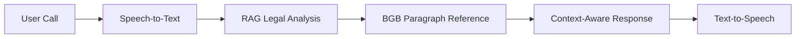

  
# CIVLEX: AI Legal Expert for German Civil Law 
**From Voice Appointments to Legal Guidance**  
`v0.5 - MVP: Appointment System Active | Next: BGB-RAG Prototype`

 


## Why This Matters ❓

**Problem**: 87% of Germans face legal issues yearly*  
**Solution**: First voice AI making Bürgerliches Gesetzbuch (BGB) accessible  

**Current MVP**:  
`Voice Appointment Booking System`  
*(Validated with 15+ local businesses)*  

**2025 Vision**:  
`AI Legal Assistant`  
- 🕒 24/7 voice access to civil law guidance  
- 📑 Automated contract review for consumers  
- ⚖️ Rights explanation with BGB citations  

_*Source: 2023 German Legal Needs Survey_


A voice-enabled system currently handling appointment booking, with development underway to become an AI Legal Assistant specializing in German Civil Law using Retrieval-Augmented Generation (RAG) technology.

  

-blue)


  

## Features ✨

  

- 📞 **Twilio Voice Integration**: Interactive voice call system

- 🔊 Text-to-speech conversion using gTTS

- 🤖 **Gemini AI Processing**: Natural language understanding

- 🗓️ **Auto-Calendar Scheduling**: Automated Google Calendar appointment scheduling

- ☁️ **Secure Storage**: Google Drive audio file management

- 🔌 **Instant Deployment**: ngrok tunneling for local development exposure

- 🚨 **Graceful Shutdown**: Signal handling for clean exits

  

## Future Vision 🔮

  

### 🧑⚖️ German Civil Law AI Legal Expert (Q3 2025)

*"Democratizing access to legal guidance through voice AI"*

  

Planned RAG-powered capabilities:



- 📚 **Legal Database**: Vectorized German Civil Law (BGB) analysis

- 🗣️ **Natural Queries**: Contract, tenant, and consumer law support

- ⚖️ **Citation System**: Direct references to legal paragraphs

- 🔍 **Multi-Issue Handling**: Contextual conversation memory

  

**Core Principle**:

*"Legal guidance, not legal advice" - Always recommends human expert consultation*

  

## Roadmap 🗺️

  

**Project Evolution Progress**

`███████████████████░░░░░░░░░░░ 65%`

*(Current focus: Legal RAG Implementation)*

  

### Phase Timeline

  

1.  **Core Appointment System**

`████████████████████████████ 100%`

✅ Completed: Voice booking + Calendar integration (Q4 2024)

  

2.  **Legal Framework Foundation**

`█████████████░░░░░░░░░░░░░░░ 45%`

🚧 In Development:

- BGB text vectorization engine

- Legal disclaimer middleware

- GDPR-compliant conversation logging

  

3.  **Expert Validation Layer**

`░░░░░░░░░░░░░░░░░░░░░░░░░░░░ 0%`

⏳ Planned:

- Legal professional verification system

- Case law correlation engine

- Multi-language support (Q4 2025)

  

### What's Next? 🔭

- [x] MVP: Voice appointment system

- [ ] Legal RAG prototype (45% complete)

- [ ] First module: Vertragsrecht (Contract Law)

- [ ] Open dataset: Annotated BGB Q&A pairs

  

**Contribution Opportunities**

We welcome collaborators on:

- German legal NLP processing

- EU AI Act-compliant architecture

- Legal citation validation systems

  

*"Building law-aware AI requires technical excellence and legal wisdom - join our mission!"*

  

---

  

## Installation 💻

  

1. Clone the repository:

```bash

git  clone  https://github.com/aks861999/voice-ai.git

cd  voice-ai

```

  

2. Create and activate virtual environment:

```bash

python  -m  venv  venv

source  venv/bin/activate  # Linux/MacOS

venv\Scripts\activate  # Windows

```

  

3. Install dependencies:

```bash

pip  install  -r  requirements.txt

```

  

## Configuration ⚙️

  

### Create `.env`:

```env

TWILIO_ACCOUNT_SID=your_twilio_sid

TWILIO_AUTH_TOKEN=your_twilio_token

GOOGLE_API_KEY=your_google_api_key

YOUR_TWILIO_NUMBER=+1234567890

YOUR_PERSONAL_NUMBER=+0987654321

NGROK_AUTH_TOKEN=your_ngrok_token

GOOGLE_DRIVE_FOLDER_ID=your_folder_id

```

  

### Google API Setup

1. Enable the following Google APIs:

- Google Calendar API

- Google Drive API

- Generative Language API

  

2. Place the following files in `secret/` directory:

-  `credentials.json` (OAuth 2.0 Client ID)

-  `token.json` (will be auto-generated)

- Service account credentials JSON file

  

### Twilio Setup

- Verify your personal number in Twilio console

- Configure webhook permissions in Twilio settings

  

## Usage 🚀

  

```bash

python  app.py

```

System will:

1. Start ngrok tunnel (public URL)

2. Initiate outbound call to your personal number

3. Launch Flask server (port 5000)

  
  
  

**Interaction Flow**:

```plaintext

Call → Name Capture → Calendar Booking → Confirmation

```

  

## API Endpoints 📡

| Route | Method | Description |

|-------|--------|-------------|

| `/welcome` | POST | Initial voice prompt |

| `/handle_user_name` | POST | Processes user identity |

  

## 🚀Main Functions

```python

def  upload_to_drive(file_path, file_name) # Uploads files to Google Drive

def  text_to_speech_and_upload(text) # Converts text to speech

def  create_appointment(patient_name) # Creates calendar event

def  make_outbound_call() # Initiates Twilio call

```

  

## Error Handling ⚠️

**Common Issues**:

-  `MissingCredentialsError`: Verify secret files

-  `NgrokConnectionError`: Check auth token

-  `CalendarAPIError`: Reauthenticate OAuth

  

**Troubleshooting**:

```bash

ngrok  http  5000  --log  stdout  # Monitor tunnel

tail  -f  logs/app.log  # View application logs

```

  

## Requirements.txt

Create a `requirements.txt` file with:

```

Flask==3.0.2

python-dotenv==1.0.1

twilio==9.3.0

google-generativeai==0.3.2

google-auth-oauthlib==1.2.0

google-api-python-client==2.120.0

gTTS==2.4.0

pyngrok==7.0.0

python-dateutil==2.9.0.post0

```

  

## License 📄

MIT License

  

**Important Notice**:

This system currently provides appointment booking services only. Future legal capabilities will include clear disclaimers and require user consent before activation.

  
  
  

---

  

*"Technology shapes law, law shapes society - let's build AI that respects both."* 🌐⚖️